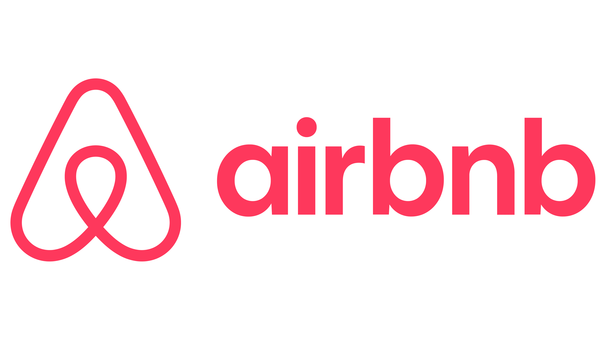

<h1 align="center">AirBnB Clone Project</h1>

## About the Project
The AirBnB Clone Project is a comprehensive full-stack simulation of a property rental platform similar to AirBnB. It is designed to immerse developers in real-world backend systems, API development, database design, and deployment strategies. The goal is to build a secure, scalable, and modular web application.

## Project Goals
- Secure user management and authentication
- Full CRUD operations for properties and bookings
- Integrated payment processing
- Review and rating system
- Efficient data handling with optimization and caching

## Tech Stack
- Backend Framework: Django, Django REST Framework
- Database: PostgreSQL
- API Protocols: RESTful API & GraphQL
- Task Queue: Celery
- Caching: Redis
- Containization: Docker
- Deployment & CI/CD: GitHub Actions, Docker Compose

## Team Roles
The AirBnB Clone project was a collaborative effort requring distinct responsibilities distributed across several specialized roles. Each role contributed significantly to the successful planning, development, and delivery of the platform.

### Backend Developer
Responsible for building and maintaining all API endpoints, implementing business logic, and integrating third-party services like payment gateways. Ensures code quality, unit testing, and adheres to RESTful and GraphQL standards.

### Database Adminstrator (DBA)
Designed and optimized the relational database schema using PostgreSQL. Implemented indexing strategies and managed data integrity, backups, and migrations for consistent performance and reliability.

### DevOps Engineer
Handled the deployment process using Docker and CI/CD pipelines. Ensured the application ran smoothly across development and production environments, monitored server health, and managed automated testing and releases.

### QA Engineer
Tested each feature for functionally, security, and performance. Wrote automated tests, reported bugs, and ensured that all components met the defined requirements and quality standards before deployment.

## Technology Stack
This project integrates a variety of modern technologies,each serving a specific purpose in building a robust, scalable, and efficient AirBnB-like booking platform.
- Django: A high-level Python web framework used to develop the backend logic and RESTful APIs quickly and securely.
- Django REST Framework: An extension of Django used to build powerful, flexible, and well-documented RESTful APIs.
- PostgreSQL: A robust relational database system used to store structured data like users, properties, bookings, and reviews.
- GraphQL: A query language and runtime for APIs, allowing clients to request only the data they need, improving performance and flexibility.
- Celery: An asynchronous task queue used for background tasks like sending notifications and processing time-consuming operations.
- Redis: A fast in-memory key-value store used to manage session data and caching, improving application speed and performance.
- Docker: A containerization tool used to create consistent development, testing, and production environments across all machines.
- CI/CD Pipelines (e.g., GitHub Actions): Automated tools for continuous integration and deployment, ensuring code changes are tested and deployed efficiently.

## Database Design
The database schema is designed to support core functionalities like user management, property listings, bookings, payments, and reviews.
Below are the key entities and their relationships:
### 1. User
- `id` (Primary Key)
- `username`
- `email`
- `password_hash`
- `is_host` (boolen to identify property owners)
> ➡️ _A user can own multiple properties and make multiple bookings._

### 2. Property
- `id` (Primary Key)
- `owner_id` (Foreign Key → User)
- `title`
- `description`
- `location`
> ➡️ _A property belongs to a user and can have many bookings and reviews._

### 3. Booking
- `id` (Primary Key)
- `user_id` (Foreign Key → User)
- `property_id` (Foreign Key → User)
- `check_in_date`
- `check_out_date`
> ➡️ _Each booking links a user to a property and may be associated with a payment._

### 4. Payment
- `id` (Primary Key)
- `booking_id` (Foreign Key → User)
- `amount`
- `payment_status`
- `payment_date`
> ➡️ _Each payment is tied to a specific booking._

### 5. Review
- `id` (Primary Key)
- `user_id` (Foreign Key → User)
- `property_id` (Foreign Key → User)
- `rating`
- `comment`
> ➡️ _A review is written by a user about a property._

## Feature Breakdown
### 1. User Management
Enables users to register, login, and manage their profiles securely. It provides the foundation for authenticating users and distinguishing between quests and property owners (hosts).

### 2. Property Management
Allows hosts to create, update, and delete property listings. It includes managing essential property details like locations, description, and pricing, making the platform rich with listings.

### 3. Booking System
Users can browse available properties, make reservations, and view booking history. It handles key logic like check-in/check-out and availability checks.

### 4. Payment Processing
Facilities secure financial transactions linked to bookings. It ensures users can make payments seamlessly and that records are stored accurately for tracking and reporting.

### 5. Review System
Enables guests to have rating and comments on properties they've stayed in. This builds trust within the community and enhances the quality of listings.

### 6. API Documentation
RESTful and GraphQL APIs are documented using OpenAPI standards. This makes it easier for frontend developers and third-party tools to integrate with the backend.

### 7. Dataase Optimizationb
Users indexing and caching strategies to improve performance and ensure fast data retival. This is critical for maintaining a responsive and scalable applications.

## API Security
### 1. Authentication
We will implement token-based authentication (e.g., JWT) to ensure that only authorized users can access protected resources. This prevents unauthorized access and ensures that user credentials are securely handed.
> Why it's crucial: Protects user data by verifying identities before granting access.

### 2. Authorization
Role-based access control (RBAC) will be used to enforce specific permissions for different types of users (e.g., guests vs hosts). Only authorized users can modify or view restricted data.
> Why it's crucial: Ensures that users can only access data or perform actions appropriate to their role.

### 3. Rate Limiting
Rate limiting will be implemented to restrict the number of requests a user can make to the API written a given timeframe, preventing abuse and mitigating DDoS attacks.
> Why it's crucial: Helps protect the system from overloading and ensures fairness in resource usage.

### 4. Encryption
Sensitive data, such as payment information and personal details, will be encrypted both in transit (via HTTPS) and at rest.

> Why it's crucial: Safeguards user privacy and payment data from unauthorized access.

## CI/CD Pipeline
Continuous Integration (CI) and Continuous Deployment (CD) pipelines automate the testing, integration, and deployment of code. CI ensures that code changes are automatically tested and integrated, while CD automatically deploys updates to production after successful tests. This helps maintain code quality, reduces manual intervention, and ensures fast, reliable releases.
### Tools to be used:
- GitHub Actions: Automates the build and testing process.
- Docker: Ensures consistent environments during development, testing, and production.
